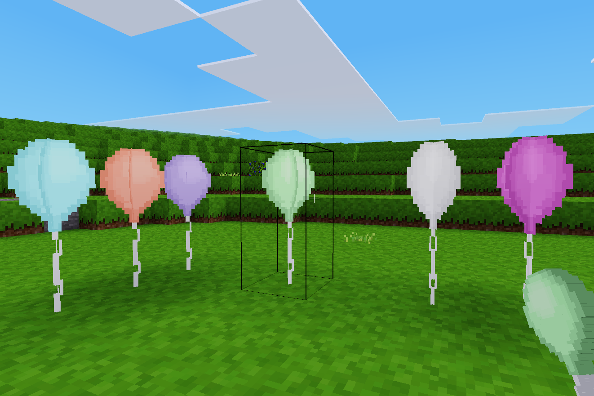

# Balloons

## Have a party!

Now you can decorate your Minetest world with balloons!

This is my first Minetest mod and I am open to any suggestions.
To craft a balloon you need *dye* of any color, *paper* and *2 strings* (`farming:string`).
We use paper there instead of rubber because I couldn't find it in default Minetest nodes.

**Crafting:**

D - dye, P - paper, S - string
```
—————————————
| D | P |   |
—————————————
|  | S |   |
—————————————
|  | S |   |
—————————————
```
**Features and things that I want to add in the future (sorted by priority):**
* Repaint any balloon with dye
* Balloons without threads
* Sounds
* Balloon will fly to the top and disappear when right click
* Pump node
* Deflate a balloon after some time

As I am quite new to modding you can help me with this by submitting changes.


